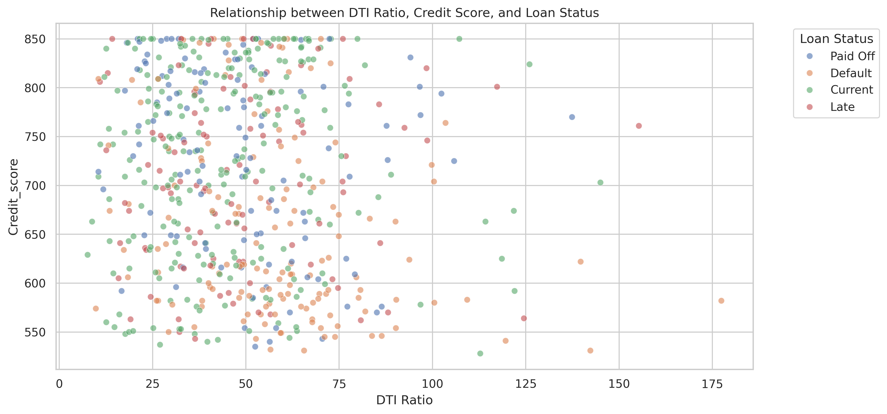
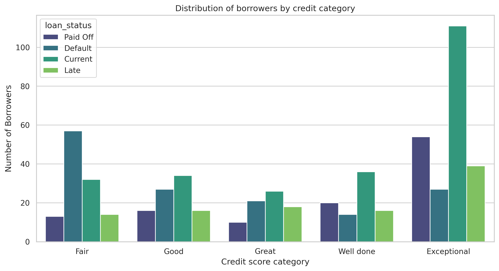
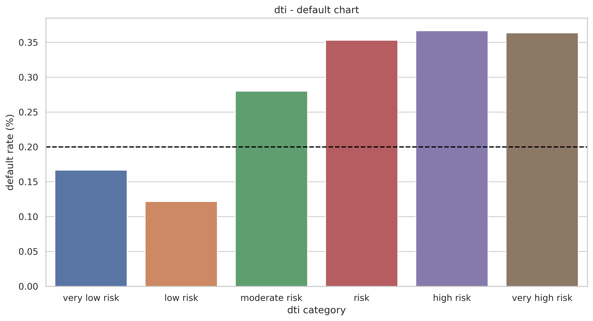

# Loan-default-risk-analysis

## Project Background

Horizon Financial Group is a mid-sized consumer lending firm specializing in providing accessible personal loans to customers. The company maintains significant datasets covering borrower demographics, loan characteristics, and repayment outcomes to identify the key risk factors that predict loan defaults.

This project thoroughly analyzes and synthesizes these data to uncover critical insights for improving the underwriting process to tackle the issue of the rising default rate on personal loans.

Insights and recommendations are provided on the following key areas:
  - Default & Delinquency trends: Analyzing historical trend patterns to improve the underwriting process.
  - Customer segmentation performance: Identifying high-risk customer segments.
 
  
Tech used: Python, Pandas, Matplotlib, Seaborn, and Google Colab.

The Python code used to load, clean, analyze, and visualize the data can be found [here]().

The visualizations can be found [here]().

## Data Structure

The dataset consists of 2 Tables: Borrowers Profiles and Loan Applications, with a total row_count of 601.

## Executive Summary

### Overview of Findings

After analyzing 600 personal loans from 2024 and 2025, the key risk drivers are: Interest rate and DTI Ratio. While high DTI typically correlates with risk, a high credit score acts as a critical 'safety net', allowing high DTI individuals with strong credit histories to maintain successful repayment. Based on these findings, a 40% DTI cutoff for standard approvals is recommended, with an exception for "exceptional" credit scorers(>749).
### Default & Delinquency trends

  - The default rate for customers with Average credit scores of 613 points is 24.47% higher than that of customers with average credit scores of 763 points.
  - Average loan amounts taken by  those who defaulted and those who did not are almost the same (22570 vs 22012).
  - The default rate goes above 20% for customers above 40% DTI ratio, and customers with credit scores above 740 act as a safety net even when the DTI is high.
  - Part-time employees default 28% of the time, meanwhile,  loan purposes like wedding, home improvement, and Auto loan defaults are >30%, 27%, and 26%,
    respectively.
  - Credit score, Annual income, and term months are great predictors of a low delinquency rate.

    

### Customer segmentation performance

  - Customers with "exceptional" credit scores (>749) pay on time 114% better than those in the "Fair" (<600) category.
  - The percentage of customers who paid off in the "exceptional" category is 133% greater than that of customers with credit scores in the "Fair" category.
  - Customers in the "moderate risk" (>40%)category for the DTI Ratio defaults 28% of the time. SO a DTI Ratio Threshold of 40% is to be considered before giving
    out loans, one exception is for those customers with a credit score in the "exceptional" category.

    
    

## Recommendations
Based on the uncovered insights, the following recommendations are provided:

  - The credit score of customers plays a significant role in deciding whether to grant them a loan or not. A credit score higher than 749 is an excellent
    indicator of delinquency.
  - A DTI Ratio of 40% or higher should be considered as a cutoff for loan approval. But one exception is those customers with more than 749
    credit score can be considered as a good candidate even with the 40% or more DTI Ratio.
  - If reducing loss is the goal, then reducing the default rate to 10% might be a good option to consider, but there are downsides, like decreased profit and
    lower customer satisfaction.
  - When deciding whether to issue a loan or not, consider: interest rate, DTI ratio, and existing monthly debt. As there is a trend showing that loans with
    interest rate exceeding 11.43% showed a significantly higher propensity for default.
    
## Caveats and Assumptions

  ### Data Caveats
    - Date column was of Object type, changed it to datetime type.
    - There were 22 cases where DTI Ratio was greater than 100% and the max reaching 177%. As there were no illogical data about those above 100% DTI Ratio and 8
      of them even paid off their loan, so it was kept.
    - Correlation heatmap pointed out data leakage were variable: days delinquent showed .88 correlation with variable defaulted. Days delinquent effectively 
      describes the state of default rather than predicting it.
  ### Assumptions
    - Assumed bins&labels during data segmentation of DTI Ratio - Defaulted chart and for credit category.

