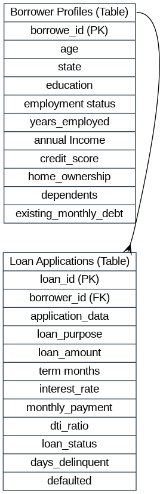

# Loan-default-risk-analysis

## Project Background

Horizon Financial Group is a mid-sized consumer lending firm specializing in providing accessible personal loans to customers. The company maintains significant datasets covering borrower demographics, loan characteristics, and repayment outcomes to identify the key risk factors that predict loan defaults.

This project thoroughly analyzes and synthesizes these data to uncover critical insights for improving the underwriting process to tackle the issue of the rising default rate on personal loans.

Insights and recommendations are provided on the following key areas:
  - Default& Delinquency trends: Analyzing historical trend patterns to improve the underwriting process.
  - Customer segmentation performance: Identifying high-risk customer segments.
 
  
Tech used: Python, Pandas, Matplotlib, Seaborn, and Google Colab.

The Python code used to load, clean, analyze, and visualize the data can be found [here]().

The visualizations can be found [here]().

## Data Structure

The dataset consists of 2 Tables: Borrowers Profiles and Loan Applications, with a total row_count of 601.

## Executive Summary

### Overview of Findings

After analyzing 600 personal loans issued across 2024 and 2025, the key risk drivers are: Interest rate, DTI ratio, existing monthly debt, and monthly payment amount. Although the main culprits are the interest rate and the DTI ratio, there are several cases where people with a high DTI ratio and Interest rate paid off the full loan amount. The variables that ensure more confidence for the company to lend loans are: a high Credit score, a high annual income, and the number of term months. A 40% DTI ratio should be considered as a good threshold as a cutoff for approving loans. The following section will explore additional contributing factors. 

### Default& Delinquency trends

  - The default rate for customers with Average credit scores of 613 points is 24.47% more than that of customers with average credit scores of 763 points.
  - Average loan amounts taken by  those who defaulted and those who did not are almost the same.
  - The default rate goes above 20% for customers above 40% DTI ratio, and customers with high credit scores act as a safety net even when the DTI is high.

